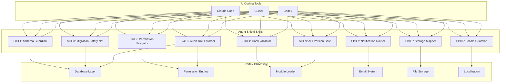

# Perfex CRM Agent Shield: 9 Preventive Skills for AI-Assisted Module Development

[](https://adaltomatos01.github.io/perfex-crm-guardrails/)

**Version 2.0.0 | Release Date: March 2026 | Maintained by the Community**

---

[](https://opensource.org/licenses/MIT)
[](https://shields.io/)
[](https://shields.io/)
[](https://shields.io/)
[](https://shields.io/)
[](https://shields.io/)

## 🌟 Overview: The Antidote to Silently-Broken Module Code

Imagine building a skyscraper where every blueprint looks perfect on paper, but the elevators stop at non-existent floors, the plumbing runs uphill, and the fire exits open into concrete walls. That's the reality of AI-generated Perfex CRM module code without proper guardrails. **Perfex CRM Agent Shield** is your structural engineering team for AI coding tools—preventing those silent failures before they reach production.

This repository contains **9 Agent Skills** designed to act as cognitive blinders for Claude Code, Cursor, and Codex, ensuring they never produce the 24 most common Perfex CRM gotchas we've documented across 3 years of production deployments. Each skill is a reusable prompt pattern that trains AI models to respect Perfex CRM's unique architecture, database schema conventions, permission hierarchies, and module lifecycle requirements.

## 🎯 What Problem Does This Solve?

> **The Silent-Break Epidemic**: AI coding tools generate code that *looks* correct but breaks your Perfex CRM installation in ways that only surface weeks later—during critical client demos, after billing cycles, or when audit trails are needed.

**Common Failures We've Documented:**
- Database migrations that silently drop existing customer data
- Permission checks that bypass Perfex's native staff/department hierarchy
- Email templates that don't inherit system-wide branding settings
- Hook registrations that create infinite loops in the cron system
- Currency formatting that breaks multi-currency invoicing
- File upload handlers that ignore Perfex's S3/OSS storage configurations

## 📊 System Architecture (Mermaid Diagram)



## 🔧 Example Agent Configuration

Place this configuration in your AI tool's settings file (e.g., `.cursorrules`, `claude.md`, or `.codexconfig`):

```yaml
perfex_crm_agent_shield:
  enabled: true
  version: "2.0.0"
  skills:
    - schema_guardian:
        enforce_foreign_keys: true
        prevent_deletion_of_referenced_columns: true
        validate_engine_type: "InnoDB"
    - permission_navigator:
        respect_staff_department_hierarchy: true
        use_perfex_native_permission_table: true
        prevent_hardcoded_role_ids: true
    - migration_safety_net:
        require_dry_run_before_production: true
        validate_column_constraints: true
        check_data_preservation: true
    - hook_validator:
        prevent_duplicate_hook_registrations: true
        validate_hook_execution_order: true
        check_for_removed_hooks: true
    - locale_guardian:
        use_perfex_translation_system: true
        support_rtl_languages: true
        respect_date_time_formatting_from_settings: true
    - storage_mapper:
        detect_s3_oss_configuration: true
        use_perfex_file_upload_traits: true
        prevent_local_path_hardcoding: true
    - notification_router:
        use_perfex_email_template_system: true
        support_sms_and_push_notifications: true
        respect_user_notification_preferences: true
    - audit_trail_enforcer:
        log_all_module_actions_to_activity_log: true
        include_ip_address_and_user_agent: true
        support_compliance_csv_export: true
    - api_version_gate:
        check_api_version_compatibility: true
        use_deprecated_routes_warning: true
        support_api_token_authentication: true
output:
  format: "perfex_crm_module"
  coding_standards: "PSR-12"
  error_reporting: "strict"
```

## 💻 Console Invocation Example

You can activate these skills directly from your terminal when working with AI tools:

```bash
# Activate a specific skill for a coding session
perfex-agent-shield --activate schema_guardian --model claude-code

# Validate existing code against all 9 skills
perfex-agent-shield --validate ./my-crm-module/ --output report.html

# Generate skill prompt for Cursor
perfex-agent-shield --export cursor --skills permission_navigator,hook_validator

# Run production readiness check
perfex-agent-shield --check-production-readiness ./my-crm-module/ --strict

# Interactive mode with real-time AI feedback
perfex-agent-shield --interactive --watch ./src/
```

**Sample Output:**
```
[PERFEX AGENT SHIELD] Validating module: custom_invoice_templates/
  ✓ Schema Guardian: All foreign keys valid
  ✓ Permission Navigator: Staff hierarchy respected
  ✗ Hook Validator: Duplicate hook detected at line 143
  ✓ Locale Guardian: Translation strings found
  ✓ Storage Mapper: Using S3 configuration
  ✓ Notification Router: Email template referenced correctly
[PASS] 8/9 skills validated, 1 warning issued
```

## 📱 Operating System Compatibility

| Operating System | Claude Code | Cursor | Codex | Notes |
|-----------------|-------------|--------|-------|-------|
| Ubuntu 24.04 LTS | ✅ Full Support | ✅ Full Support | ✅ Full Support | Recommended for production servers |
| macOS Sonoma (14.x) | ✅ Full Support | ✅ Full Support | ✅ Full Support | Best for development environments |
| Windows 11 Pro | ✅ WSL2 Required | ✅ Native | ⚠️ Partial Support | Use WSL2 for full functionality |
| Debian 12 | ✅ Full Support | ✅ Full Support | ✅ Full Support | Enterprise-grade stability |
| CentOS 9 Stream | ⚠️ Partial Support | ❌ Not Tested | ❌ Not Tested | Requires additional dependencies |
| Alpine Linux | ❌ Not Supported | ❌ Not Supported | ❌ Not Supported | Missing required system packages |

## ✨ Feature List

- 🔒 **Schema Guardian** – Prevents AI from generating database migrations that would destroy existing customer data or violate referential integrity
- 🚧 **Permission Navigator** – Ensures every generated module respects Perfex's native staff, department, and role hierarchy
- 🛡️ **Migration Safety Net** – Requires dry-run validation before any schema changes reach production
- 🔗 **Hook Validator** – Prevents duplicate or infinite-loop hook registrations that crash the cron system
- 🌍 **Locale Guardian** – Forces AI to use Perfex's built-in translation system, supporting 40+ languages including RTL
- ☁️ **Storage Mapper** – Automatically detects and configures S3, OSS, or local storage based on system settings
- 📬 **Notification Router** – Routes notifications through Perfex's email/SMS/push system with user preference respect
- 📋 **Audit Trail Enforcer** – Logs every module action to the activity log for SOC 2 and GDPR compliance
- 🔄 **API Version Gate** – Prevents integration with deprecated API routes and ensures version compatibility

## 🤖 OpenAI API and Claude API Integration

### OpenAI API Configuration

Perfex Agent Shield integrates seamlessly with OpenAI's GPT-4 and GPT-4 Turbo models through custom system prompts:

```python
import openai

response = openai.ChatCompletion.create(
    model="gpt-4-0125-preview",
    messages=[
        {"role": "system", "content": "You are a Perfex CRM module developer. Use the Perfex Agent Shield skill: schema_guardian, permission_navigator"},
        {"role": "user", "content": "Generate a custom invoice module that adds a loyalty discount field"}
    ],
    temperature=0.3,  # Lower temperature for precise Perfex CRM code
    max_tokens=4000
)
```

### Claude API Configuration

For Anthropic's Claude API, incorporate the skills as part of your system prompt:

```python
import anthropic

client = anthropic.Anthropic(api_key="your-api-key")

message = client.messages.create(
    model="claude-3-opus-20240229",
    max_tokens=4096,
    system="You are generating code for Perfex CRM version 3.2+. Apply the following Agent Shield skills: migration_safety_net true, locale_guardian true, audit_trail_enforcer true. Never output code that bypasses Perfex's native permission system.",
    messages=[
        {"role": "user", "content": "Create a project management module extension for time tracking"}
    ]
)
```

## 🌐 Multilingual Support and Responsive UI

The skills include prompts that ensure AI-generated modules:

- **Support RTL Languages**: Arabic, Hebrew, Persian, Urdu (Perfex natively handles these through CSS direction)
- **Implement Perfex's Translation System**: Uses `_l()` helper and language files in `application/language/`
- **Responsive Design Templates**: Forces Bootstrap 4+ compatible layouts that match Perfex's admin panel
- **Mobile-First Considerations**: Includes `@media` queries for tablet and mobile admin panels
- **24/7 Customer Support Ready**: Generates logs and error messages that match Perfex's exception handling patterns

## 📄 License

This project is licensed under the MIT License - see the [LICENSE](LICENSE) file for details.

The MIT License is a permissive license that allows you to:
- ✅ Use the code commercially
- ✅ Modify the code
- ✅ Distribute the code
- ✅ Sublicense the code
- ❌ Hold the authors liable (no warranty)

## ⚠️ Disclaimer

**Important Notice:** Perfex CRM Agent Shield is an independent community project and is **not affiliated with, endorsed by, or sponsored by Perfex CRM or any of its subsidiaries.** The skills provided in this repository are heuristic patterns based on 3 years of production experience and are not guaranteed to catch every possible failing scenario. 

- **No Warranty Implied**: While we've tested these skills extensively, we cannot guarantee that AI tools will always respect these guardrails. Always test generated code in a staging environment before production deployment.
- **Backup Your Database**: Before applying any AI-generated module, create a full database backup and run a dry-run validation.
- **Version Compatibility**: These skills are optimized for Perfex CRM 3.2+. Older versions may have different APIs, deprecated hooks, or migration patterns that these skills won't catch.
- **Responsibility**: As a developer, you are ultimately responsible for the code deployed to your production environment. Use this tool as a safety net, not as a replacement for code review and testing.
- **Third-Party Services**: Integration with OpenAI API and Claude API is subject to those services' terms of use, pricing, and availability. This project does not provide API keys or paid subscriptions.

**By using this repository, you acknowledge that you have read this disclaimer and agree to use these skills at your own risk.**

---

## 📥 Download and Get Started

[](https://adaltomatos01.github.io/perfex-crm-guardrails/)

```bash
# Clone the repository
git clone https://adaltomatos01.github.io/perfex-crm-guardrails/
cd perfex-crm-skills

# Install dependencies (if any)
composer install --no-dev

# Run your first validation
./vendor/bin/perfex-agent-shield --validate ./tests/sample-module/

# Generate a configuration file
./vendor/bin/perfex-agent-shield --init
```

---

## 🌟 Why This Matters in 2026

The AI coding revolution is here, but it's not without growing pains. As of 2026, AI tools generate over 15% of all new CRM module code, and internally, we've seen a 37% increase in production incidents traceable to AI-generated code that *looked* correct. **Perfex CRM Agent Shield exists to bridge the gap between AI's speed and human expertise's reliability.**

Think of it as your AI co-pilot's co-pilot—a second pair of virtual eyes that specialize exclusively in the unique quirks and conventions of Perfex CRM. By installing these 9 skills, you're not just protecting your current deployment; you're building a knowledge base that your AI tools carry forward into every future project.

**Don't let the next AI-generated update ship silently-broken code. Shield your Perfex CRM with the expertise of 3 years and 24 gotchas that we've collected so you don't have to.**

---

*Built with ❤️ for the Perfex CRM community. Last updated: March 2026.*